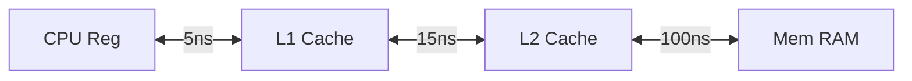

## 1. Basic Concepts and Computer Systems History

### Main Computer Functions
- Data processing - performing mathematical operations
- Data movement - defining the destination of results
- Data storage - ensuring persistence
- Data control - managing and manipulating data

---

## 2. Bus, Memory, IO and OS Support

### CPU Architecture with Two Caches  

#### Memory Access Diagram:

#### Definitions:  
- **HR (Hit Rate)** – The percentage of accesses that hit in a cache level  
- **MR (Miss Rate)** – The percentage of accesses that miss in a cache level  
- **AT (Access Time)** – The time required to access a memory level

#### Formula:

$$
EAT = (HR_{L1} \times AT_{L1}) + (MR_{L1} \times AT_{L2}) + (MR_{L1} \times MR_{L2} \times AT_{RAM})
$$

###### Example:

$HR_{L1}=1.0$
$MR_{L1}=0.1$
$MR_{L2}=0.05$

$$
EAT = (1.0 \times 5ns) + (0.1 \times 15ns) + (0.1 \times 0.05 \times 100ns)
$$

$$
EAT = 5ns + 1.5ns + 0.5ns
$$

$$
EAT = 7ns
$$

