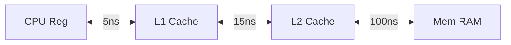

## 1. Basic Concepts and Computer Systems History

### Main Computer Functions
- Data processing - performing mathematical operations
- Data movement - defining the destination of results
- Data storage - ensuring persistence
- Data control - managing and manipulating data

---

## 2. Bus, Memory, IO and OS Support

### CPU Architecture with Two Caches  

#### Diagram:

#### Definitions:  
- **HA (Hit Rate)** – The percentage of accesses that hit in a cache level  
- **MR (Miss Rate)** – The percentage of accesses that miss in a cache level  
- **AT (Access Time)** – The time required to access a memory level

$AT​=AT×(100AR​)×(1+FR)$